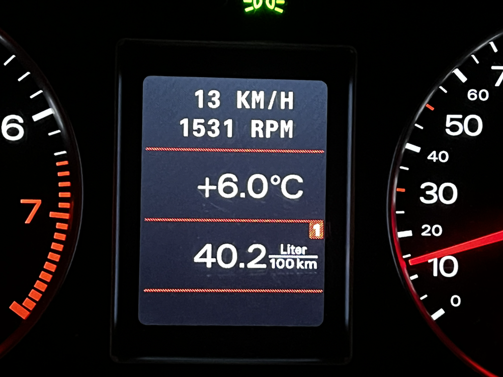
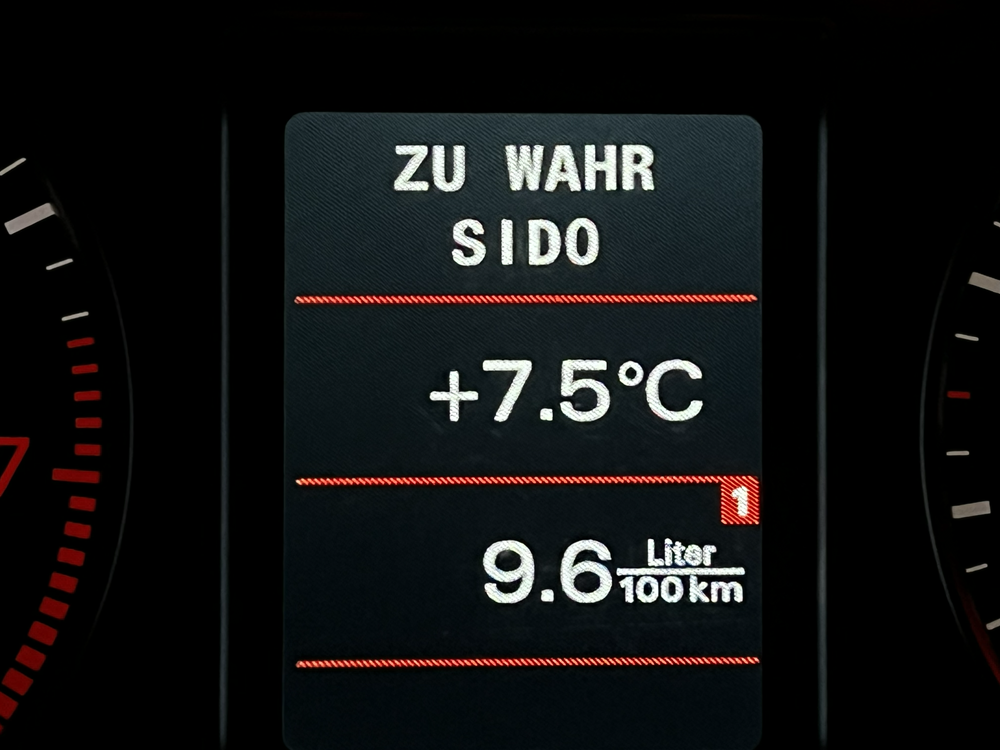
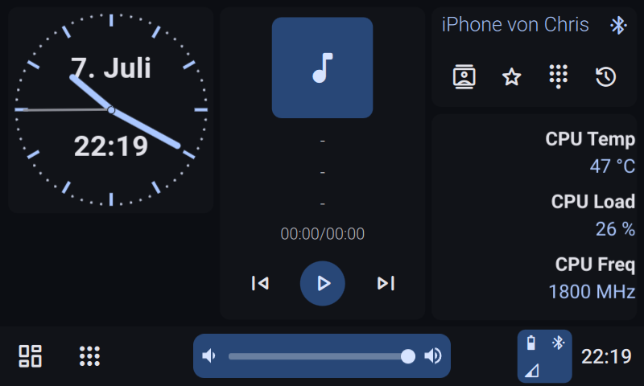
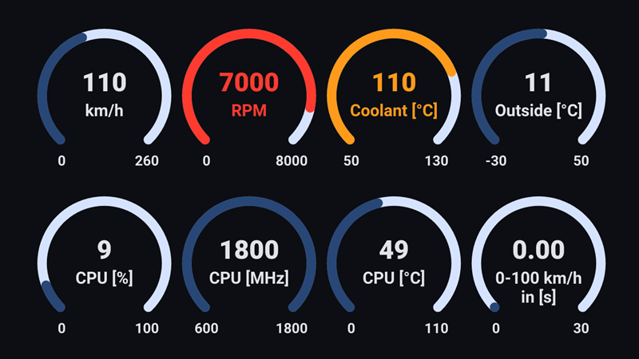
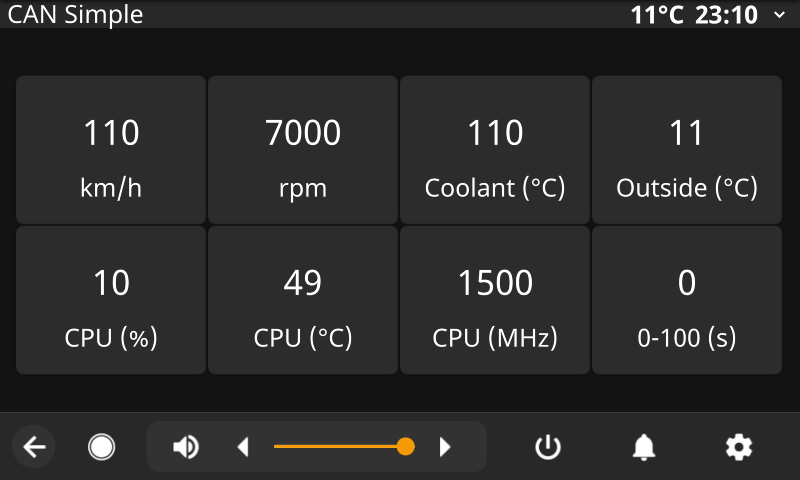
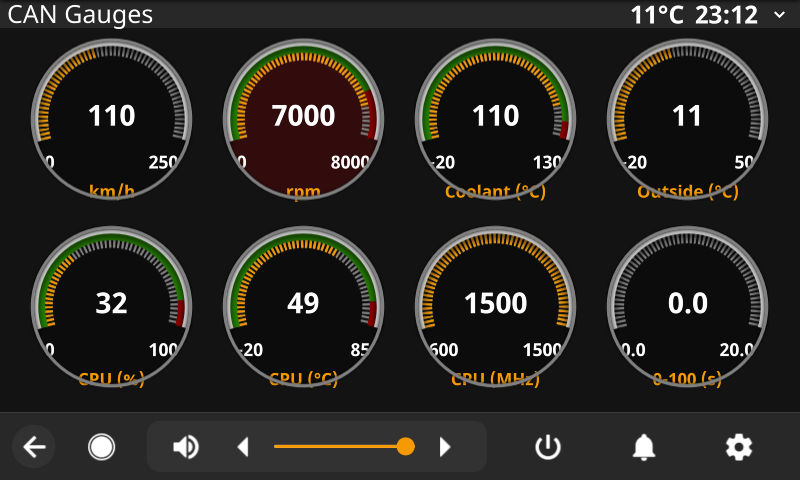

# Audi CAN Bus to DIS/FIS via Raspberry Pi (with Hudiy AND OpenAuto Pro support)

This project displays CAN bus data such as speed and RPM in the vehicle's DIS/FIS using a Raspberry Pi. It can also control the Raspberry Pi through the RNS-E buttons while the head unit is in TV mode. Additional integrations are available for Hudiy and OpenAuto Pro, although OpenAuto Pro has been discontinued.

> **ℹ️ Note:**
> I'm not a professional developer – most of my knowledge is self-taught. I designed this script so that almost all functions can be activated or deactivated individually. My goal was to make the script install all missing components (e.g., Python modules) automatically so minimal prior knowledge is required.
> 
> This script is the result of years of work and runs very well in my own setup. However, I can only test it in my own car. In theory, it should work with other models as well. For this reason, I have created a table of compatible and tested models. Feedback after testing is highly appreciated so we can keep this table updated!

I use this script with a **Raspberry Pi 4** connected to an **RNS-E** in an **Audi A4 B6 (8E)**. It integrates with **Hudiy and OpenAuto Pro**. The Hudiy and OpenAuto Pro integrations can be disabled, so the script can also run without either platform.

---

## Tested Software Environments

The project has been tested successfully with the following software combinations:

| Raspberry Pi OS | Integration | Version | Python | Status |
|---|---|---:|---:|---|
| Trixie | Hudiy | 2.16 | 3.13.5 | ✅ Tested |
| Bookworm | Hudiy | 1.20 | 3.11.2 | ✅ Tested |
| Buster | OpenAuto Pro | 16.1 | 3.7.3 | ✅ Tested |

Other combinations may also work, but have not been tested yet.

---

## Main Features


### 1. Driver Information System (DIS/FIS) Text Output
The script can write to the first two lines of the **DIS/FIS** (Driver Information System) in the instrument cluster. It can overwrite existing texts (e.g., from the radio or IMA modules) via the telephone channel.

  &nbsp;&nbsp;&nbsp; 

| **CAN Bus Data (Infotainment Bus)** | **Hudiy / OpenAuto Pro Media Info** | **Raspberry Pi System Data** |
|-------------------------------------|--------------------------------------|-------------------------------|
| - Speed<br>- RPM<br>- Coolant temperature<br>- Outside temperature (A4 8E only)<br>- Custom speed measurement value<br>- Blank line (no content) | - Title<br>- Artist<br>- Album<br>- Song position<br>- Song duration | - CPU usage<br>- CPU temperature<br>- CPU frequency |


**Alternative mode:**  
It can also display only a single value in the FIS/DIS with a custom title.

---

### 2. Additional Functions

- **Auto-Setup** – Installs all required packages on first start (incl. PiCan2/PiCan3).
- **Feature Control** – Enable/disable all features individually.
- **RNS-E Button Control** ([keymap PDF](docs/read_from_canbus%20keymap.pdf))
  - Long press **UP/DOWN**: Cycle displayed FIS/DIS values
  - Very long press **RETURN**: Start/stop `candump`
  - Extreme long press **SETUP** (~5s): Shutdown Raspberry Pi
  - More functions in keymap file
- **MFSW (Multi Function Steering Wheel)** – Supported, but may conflict with hands-free control.  
  → Recommended: disable/remove hands-free hardware to avoid conflicts.
- **Reverse Camera**
  - Activate PiCamera when reverse gear detected via CAN Bus
  - Optional guidelines overlay
  - Toggle camera via very long press **DOWN**
- **Display Options** – Scrolling text or OEM-style 3s paging.
- **Theme Switching** – Day/night mode changes based on vehicle lights.
- **Speed Measurement**
  - Precision: 0.1s
  - Adjustable range (e.g., 0–100, 100–200 km/h)
  - Export results to file
- **System Integration**
  - Shutdown Pi on ignition off/key removal
  - Switch metric/imperial units (km/h ↔ mph, °C ↔ °F)
  - Debug logging for troubleshooting
- **RNS-E TV Mode Control**
  - Switch tv input activation format (PAL/NTSC)
  - Useful for custom video without IMA
  - Recommended firmware: [link](https://rnse.pcbbc.co.uk/index.php)
    
---

### 3. Hudiy Features

- Display media information in the FIS/DIS
- Change the Hudiy day/night theme based on the vehicle lighting
- Send CAN bus and system data to Hudiy applications, including gauges, widgets, reverse camera pages and Raspberry Pi controls

  &nbsp;&nbsp;&nbsp; 

---

### 4. OpenAuto Pro Features

> [!NOTE]
> OpenAuto Pro has been discontinued. This integration is retained for existing installations.

- Display media information in the FIS/DIS
- Change the OpenAuto Pro day/night theme based on the vehicle lighting
- Send CAN bus and system data to the OpenAuto Pro API for dashboard display

  &nbsp;&nbsp;&nbsp; 

---

### 5. Car Compatibility &nbsp;&nbsp;&nbsp; [](https://github.com/noobychris/audi-can-rpi/issues/new?labels=compatibility&template=report_compatibility.yml)

| Model        | DIS/FIS Output | MFSW | Outside Temp | Note |
|--------------|----------------|------|--------------|------|
| Audi A4 8E   | ✅              | ⚠️    | ✅           |      |
| Audi A3 8L   | ⚠️              | ⚠️    | ⚠️           |      |
| Audi A3 8P   | ⚠️              | ⚠️    | ⚠️           |      |
| Audi TT 8J   | ⚠️              | ⚠️    | ⚠️           |      |
| Audi R8 42   | ⚠️              | ⚠️    | ⚠️           |      |

**Legend:**  
✅ = Tested and working  
⚠️ = Not yet tested / uncertain 

Note: The vehicles listed above should be compatible based on CAN dump analysis from these models. Other vehicles may also work if they use the same CAN messages.

---


## Installation and Setup

### Configure the features

Open `setup.html` on your computer in a web browser.

The configurator already contains suitable default values. Adjust the settings for your vehicle and installation, then save the generated configuration file:

```text
features.conf
```

The generated `features.conf` file must later be copied into the same directory as `read_from_canbus.py`.

---

### Copy the repository files

Copy the repository contents to `/home/pi/` so that the included `scripts` directory is located at:

```text
/home/pi/scripts/
```

> [!WARNING]
> The included `.hudiy` folder contains the gauges and additional HTML page integrations, but it also replaces the existing Hudiy main menu.
>
> Back up your current Hudiy configuration before copying the included `.hudiy` folder:
>
> ```bash
> cp -a /home/pi/.hudiy /home/pi/.hudiy-backup
> ```
>
> If you already use a customized Hudiy menu, do not overwrite the complete `.hudiy` directory without checking its contents first. Merge the required files manually instead.

The relevant part of the resulting directory structure should look like this:

```text
/home/pi/
├── .hudiy/
│   └── share/
│       └── config/
├── .openauto/
│   ├── backgrounds/
│   └── config/
├── docs/
│   ├── read_from_canbus keymap.pdf
│   └── screenshots/
├── scripts/
│   ├── features.conf
│   ├── pi_control.py
│   ├── read_from_canbus.py
│   ├── setup.html
│   └── hudiy_api/
│       └── html_files/
│           ├── analog_clock.html
│           ├── camera_web.html
│           ├── camera_web_with_lines.html
│           ├── cpu_widget.html
│           ├── gauges.html
│           ├── lines.png
│           └── pi_control.html
└── tools/
    ├── debugging_script.py
    ├── fis.png
    └── rns-e.png
```

`/home/pi/scripts/` is the central working directory for the main scripts, the generated configuration and the Hudiy web files.

Make sure that the generated `features.conf` is placed directly next to `read_from_canbus.py`:

```text
/home/pi/scripts/features.conf
/home/pi/scripts/read_from_canbus.py
```

The `.openauto` directory is only required for the optional OpenAuto Pro integration. The `tools` directory contains the optional CAN debugging GUI and its required images.

---


### First manual start with internet access

Before enabling automatic startup, start both scripts manually at least once while the Raspberry Pi has an active internet connection.

This allows the scripts to create the required virtual environment and install missing Python packages and dependencies.

First start `read_from_canbus.py`:

```bash
cd /home/pi/scripts
/home/pi/.venv-canbus/bin/python3 read_from_canbus.py
```

Wait until the initial setup and package installation have completed successfully, then stop the script with:

```text
Ctrl+C
```

Then start `pi_control.py`:

```bash
cd /home/pi/scripts
/home/pi/.venv-canbus/bin/python3 pi_control.py
```

Again, wait until the initial setup and package installation have completed successfully, then stop the script with:

```text
Ctrl+C
```

The first start may take longer because missing packages are installed automatically.

Do not enable the automatic startup entries before both scripts have completed their first manual start successfully.

---

### Automatic startup

Open the crontab of the `pi` user:

```bash
crontab -e
```

Add the following entries:

```cron
@reboot sh -c 'cd /home/pi/scripts && /home/pi/.venv-canbus/bin/python3 pi_control.py &'
@reboot sh -c 'cd /home/pi/scripts && /home/pi/.venv-canbus/bin/python3 read_from_canbus.py &'
```

The `cd /home/pi/scripts` part is important because both scripts use this directory as their working directory.

This ensures that:

- `read_from_canbus.py` finds `features.conf`
- `pi_control.py` finds the Hudiy HTML files
- relative paths to images and other resources continue to work

`pi_control.py` starts the Flask web server for the Hudiy pages.

`read_from_canbus.py` handles CAN bus communication, FIS/DIS output, RNS-E controls and the enabled vehicle functions.

Both scripts are started using the Python virtual environment located at:

```text
/home/pi/.venv-canbus/
```

---

### Flask and Hudiy pages

`pi_control.py` starts the Flask web server used to provide gauges, controls and additional HTML pages inside Hudiy.

The HTML files are located in:

```text
/home/pi/scripts/hudiy_api/html_files/
```

This directory contains:

| File | Function |
|---|---|
| `analog_clock.html` | Analog clock with date and digital time |
| `camera_web.html` | Reverse camera view without guidelines |
| `camera_web_with_lines.html` | Reverse camera view with guideline overlay |
| `cpu_widget.html` | Widget for CPU temperature, CPU load and CPU frequency |
| `gauges.html` | Main CAN bus gauge dashboard |
| `pi_control.html` | Hudiy controls for exiting Hudiy, rebooting and shutting down the Raspberry Pi |
| `lines.png` | Guideline overlay used by `camera_web_with_lines.html` |

The HTML files and `lines.png` should remain inside this directory because the Flask routes and HTML pages use relative file paths.

Do not move individual files to another directory unless the corresponding paths in `pi_control.py` and the HTML files are adjusted as well.

> **Note**
>
> `pi_control.py` is the Python script that starts the Flask server.
>
> `hudiy_api/html_files/pi_control.html` is the visible control page shown inside Hudiy.

---


## 📨 Feedback & Support

Found a bug? Have an idea or question?  
Your feedback helps improve this project!

[](https://github.com/noobychris/audi-can-rpi/issues/new?template=bug_report.yml&labels=bug)
[](https://github.com/noobychris/audi-can-rpi/issues/new?template=feature_request.yml&labels=enhancement)
[](https://github.com/noobychris/audi-can-rpi/issues/new?labels=compatibility&template=report_compatibility.yml)
[](https://github.com/noobychris/audi-can-rpi/issues/new?template=question.yml&labels=question)
[](https://github.com/noobychris/audi-can-rpi/discussions)

- **🐞 Report a bug** – Use the [Bug Report form](https://github.com/noobychris/audi-can-rpi/issues/new?template=bug_report.yml&labels=bug) to help us fix it quickly.
- **💡 Request a feature** – Share your idea via the [Feature Request form](https://github.com/noobychris/audi-can-rpi/issues/new?template=feature_request.yml&labels=enhancement).
- **🚗 Report compatibility** –  Report a (partially) compatible model via the [Compatibility form](https://github.com/noobychris/audi-can-rpi/issues/new?labels=compatibility&template=report_compatibility.yml).
- **❓ Ask a question** – Use the [Question form](https://github.com/noobychris/audi-can-rpi/issues/new?template=question.yml&labels=question) for setup help, usage tips, or troubleshooting advice.
- **💬 Join discussions** – Ask broader questions, share test results, or brainstorm in the [Discussions area](https://github.com/noobychris/audi-can-rpi/discussions).

---

## My Setup

- Audi A4 B6 (8E) Avant 2001  
- Seat Exeo RNS-E 3R0 035 192  
- Raspberry Pi 4  
- PiCan 3  
- CarlinKit 2022 CPC200-AutoKit (Apple CarPlay)  
- [My VGA Sync Combiner for Audi RNS-E – soldering required](https://github.com/noobychris/vga-sync-combiner-audi-rnse)
- [Hama Video Adapter HDMI™ Plug to VGA Socket (00200344)](https://nordics.hama.com/00200344/hama-video-adapter-hdmi-plug-vga-socket-full-hd-1080p)

## License

This project is licensed under the MIT License.

You are free to use, copy, modify, distribute, and sell this software,
provided that the original copyright notice and license text are retained.

See the [LICENSE](LICENSE) file for the full license text.
